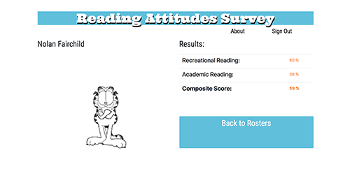

# Elementary Reading Attitudes Survey

An electronic implementation of the [Elementary Reading Attitudes Survey](http://www.leadtoreadkc.org/wp-content/uploads/2012/12/Professor-Garfield-reading-survey-used-by-Lead-to-Read-KC.pdf) by Michael C. McKenna and Dennis J. Kear.

With this app, teachers can measure students' feelings toward academic and recreational reading which are predictors of
success in reading in elementary school. Teachers create class rosters which generate a random key code for students to 
access the survey. Students can take the survey and the results are calculated and stored in a database and available
to the teacher to evaluate.




## Technologies Used

* AngularJS
* Bootstrap 4
* Sass
* E6
* Firebase

## Installation and setup

The app requires Node Package Manager and Sass

1. Download the GitHub repository:

``` $ git clone https://github.com/jsheridanwells/Reading-Attitudes-Survey-Angular-Version.git```

2. Change to the lib directory:

``` $ cd Reading-Attitudes-Suvey-Angular-Version/lib```

3. Install dependencies using the Node Package Manager:

``` $ npm install ```

Before running the server, a Firebase database and credentials will need to be added.

1. Create a new project in Firebase or modify an existing project.

2. Change the database rules to the following:

```
{
  "rules": {
    ".read": "auth != null",
    ".write": "auth != null",
    "students" : {
      ".indexOn" : ["accessCode", "uid"]
    }
  }
}
```

1.  From the root directory, create the following directory and .js file for reading Firebase credentials:

	`$ mkdir app/credentials/ && cd $_`

2. Create a javascript file to hold Firebase credentials.

	`$ touch fb-creds.js`

3. In the `fb-creds.js` file, copy the following code, modifying the values to your own Firebase config settings:

```javascript
'use strict';

app.constant('FBCreds', {
	apiKey: "[YOUR API KEY]",
        authDomain: "[YOUR FIREBASE DOMAIN]",
        databaseURL: "[YOUR DATABASE URL]"
});

```

4. To run the http server and build the dist directory, move to the `lib` directory and run Grunt:

	`$ cd lib && grunt`

## Author
  Jeremy Sheridan Wells

  [Github: jsheridanwells](http://www.github.com/jsheridanwells)

  [Twitter: @jsheridanwells](http://twitter.com/jsheridanwells)
